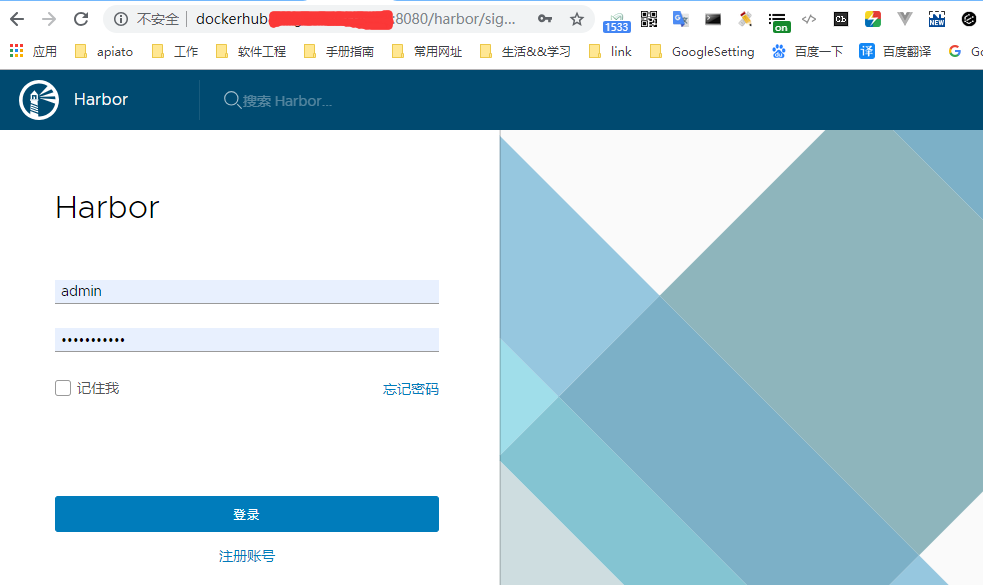
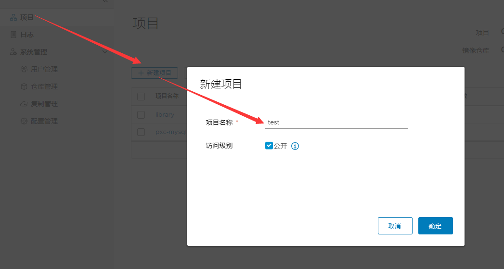
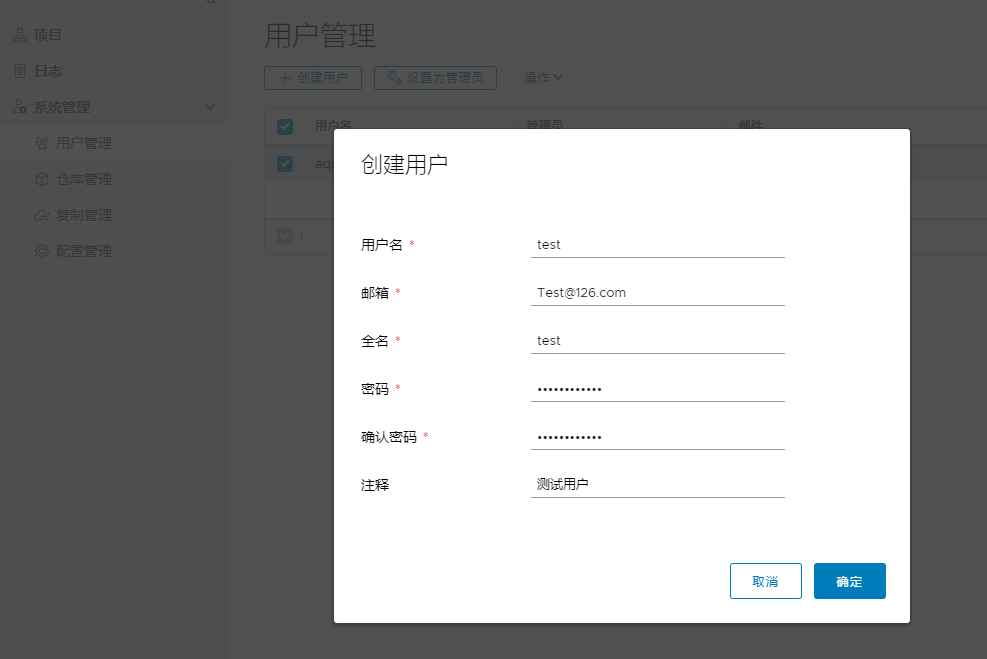
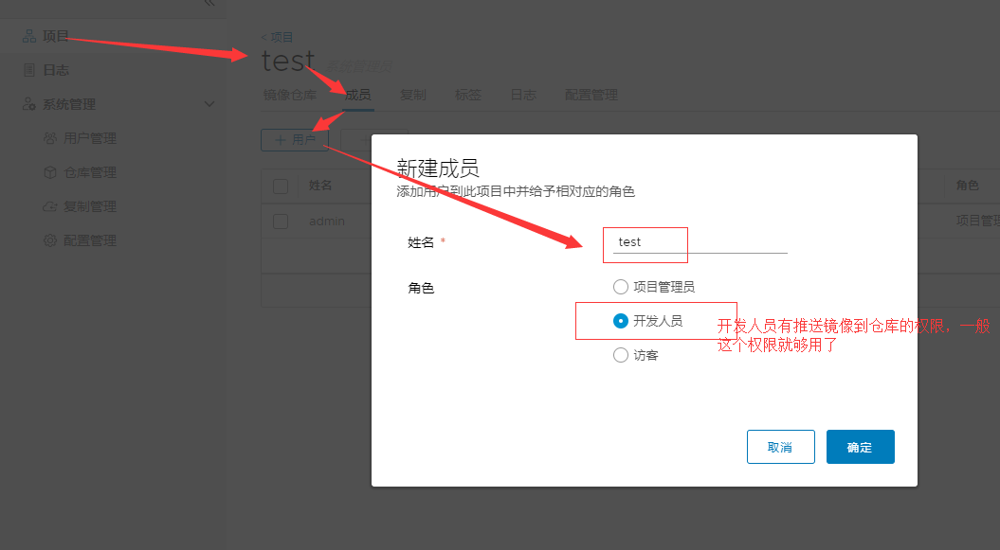
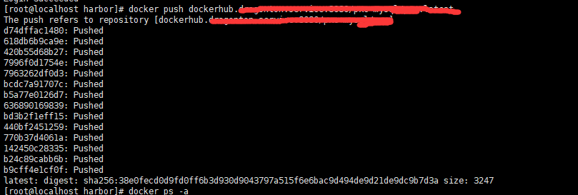

## 搭建私有镜像仓库

### 一.安装官方私有镜像仓库(字符界面)
```
docker pull registry
```
#### 运行官方的私有仓库容器
`run`运行一个容器
`-d`后台运行
`-v`卷挂载:将主机目录/opt/registry挂载点到容器中的/var/lib/registry
`-p`端口映射主机5000:容器5000
`--restart=always` 总是重启:当容器挂掉时总是自动重启
`--name dockerRegisxtry`给创建的容器的起一个名字dockerRegisxtry
`registry` 指定使用哪个images镜像
```

docker run -d -v /opt/registry:/var/lib/registry -p 5000:5000 --restart=always --name dockerRegisxtry registry
```

#### 配置私有仓库可信任,此处不设置信任`docker push ...`会导致HTTPS的传输错误
>192.168.1.120 为私有仓库的IP地址,此处为当前的主机地址做的端口映射5000,与上一步指定 -p 参数有关
```
# vi /etc/docker/daemon.json 
{
  "insecure-registries":["192.168.1.120:5000"]
} 
```
#### 重启 docker 服务
```
# service docker restart
```
#### 打标签
```
# docker tag centos:6 192.168.1.120:5000/centos:6
```
#### 上传到私有仓库
```
# docker push 192.168.1.120:5000/centos:6
```
#### 下载私有仓库中的镜像
```
# docker pull 192.168.1.120:5000/centos:6
```
#### 列出镜像标签
```
# curl http://192.168.1.120:5000/v2/centos/tags/list
```
#### 列出所有镜像
```
#curl http://192.168.1.120:5000/v2/_catalog
```

### 二.安装私有镜像仓库Harbor(图形界面)
环境说明：
虚拟机Harbor：192.168.1.10 开 8080 端口 安装Harbor服务
虚拟机test：192.168.1.11 用作私有镜像推送的测试服务器
两台虚拟机需要提前都安装好docker服务，没有这里不再介绍docker服务的安装
##### 1 下载安装文件
进入虚拟机Harbor: 192.168.1.10
```bash
# docker-composer 依赖安装
curl -L https://github.com/docker/compose/releases/download/1.24.0-rc1/docker-compose-`uname -s`-`uname -m` -o /usr/bin/docker-compose
sudo chmod +x /usr/bin/docker-compose

# 下载运行脚本文件
wget https://storage.googleapis.com/harbor-releases/release-1.7.0/harbor-offline-installer-v1.7.5.tgz

# 解压后在当前目录下会生成一个 harbor的目录，里面放的就是私有镜像仓库的启动文件
tar -xvf harbor-offline-installer-v1.7.5.tgz
```

##### 2 修改harbor配置并启动
```bash
# 进入harbor目录修改相关配置文件
cd harbor
vim harbor.cfg
hostname = dockerhub.xxx.com:8080 # 给仓库配置一个域名，并绑定一个端口进行访问
 
# 修改绑定的端口
vim docker-compose.yml
ports:
  - 8080:80

# 执行安装脚本
./install.sh

# 出现下面的信息表示安装成功，可以访问了http://dockerhub.xxx.com:8080.
✔ ----Harbor has been installed and started successfully.----

Now you should be able to visit the admin portal at http://dockerhub.xxx.com:8080. 
For more details, please visit https://github.com/goharbor/harbor .


-------------------------- 常用操作 -----------------------------------------------------

#停止：
docker-compose -f docker-compose.yml stop

#启动：
docker-compose -f docker-compose.yml start

#如果修改了配置文件，执行如下步骤：
docker-compose down
vim harbor.cfg
./install.sh
```
[点击查看docker-compose.yml配置文件示例](./source/docker-compose.yml) | [点击查看harbor.cfg配置文件示例](./source/harbor.cfg)
> 注意：安装时要使用很多系统目录挂载，如果希望指定目录挂载的位置可以通过修改配置文件实现。具体可以查看上面的配置文件示例。（MAC系统的电脑因为有目录权限限制，因此要先去修改指定的挂载目录位置）

##### 3 通过浏览器登录并管理Harbor
- /etc/hosts域名绑定 
>说明：因为我所有的服务都是在虚拟机安装和测试的，域名并没有在互联网解析，所以需要将域名绑定到虚拟机的IP 192.168.1.10，而虚拟机上的Harbor服务已经监听了0.0.0.0:8080。如果做了域名解析服务的可以忽略此步骤
```bash
# 添加域名绑定后再进行访问
192.168.1.10 dockerhub.xxx.com
```
- 浏览器登录 http://dockerhub.xxx.com:8080
```bash
# 默认登录账户和密码(可以在harbor.cfg配置中查看，正式环境记得登录后修改默认密码)
admin
Harbor12345
```

##### 4 在Harbor创建一个私有仓库，并添加用户权限
- 创建`test`项目仓库，是否公开根据项目需要设置，具体查看i说明

- 创建一个管理用户`test`

- 给`test`项目添加添加一个项目成员`test`（姓名：需要在上一步先创建test用户这里才能填写，无法添加不存在的用户。角色：一般设置开发人员权限就够用了）


##### 5 推送镜像到私有仓库
进入虚拟机test: 192.168.1.11
- /etc/hosts域名绑定 
>说明：因为我所有的服务都是在虚拟机安装和测试的，域名并没有在互联网解析，所以需要将域名绑定到虚拟机的IP 192.168.1.10，而虚拟机上的Harbor服务已经监听了0.0.0.0:8080。如果做了域名解析服务的可以忽略此步骤
```bash
# 添加域名绑定
vim /etc/hosts
192.168.1.10 dockerhub.xxx.com
```

- 推送镜像前的docker配置
```bash
# 因为没有HTTPS证书，使用的HTTP协议做的传输，需要在docker里面添加http信任
# vi /etc/docker/daemon.json 
{
  "insecure-registries":["dockerhub.xxx.com:8080"]
} 

# 重启docker
systemctl restart docker
```

- 登录到Harbor服务器
```bash
docker login dockerhub.xxx.com:8080
Username: test
Password: 
WARNING! Your password will be stored unencrypted in /root/.docker/config.json.
Configure a credential helper to remove this warning. See
https://docs.docker.com/engine/reference/commandline/login/#credentials-store

Login Succeeded
```

- 推送本地 nginx 镜像到私有仓库
```bash
# 在 192.168.1.11 里面已经存在了 nginx 镜像，通过 docker images 可以看到本地所有镜像
# 本地给nginx镜像打一个标签 dockerhub.xxx.com:8080/test/nginx:latest
docker tag nginx:latest dockerhub.xxx.com:8080/test/nginx:latest

# 推送成功后生成一个验证码，这个通过浏览器在管理平台就可以看到推送的镜像了
docker push dockerhub.xxx.com:8080/test/nginx:latest
```


> Harbor 的界面简洁，操作简单，支持多语言，支持用户权限限定，支持打标签，支持分布部署和同步等。具体使用可以自己摸索，整个使用比较简单，这里就不再过多的介绍。


### 三. Docker Hub公共镜像仓库使用
#### 1、注册账号
https://hub.docker.com
#### 2、登录Docker Hub
```
# docker login
```
或
```
# docker login --username=lizhenliang --password=123456
```
#### 3、镜像打标签
```
# docker tag wordpress:v1 lizhenliang/wordpress:v1
```
#### 4、上传
```
# docker push lizhenliang/wordpress:v1
```
搜索测试：
```
# docker search lizhenliang
```
#### 5、下载
```
# docker pull lizhenliang/wordpress:v1
```