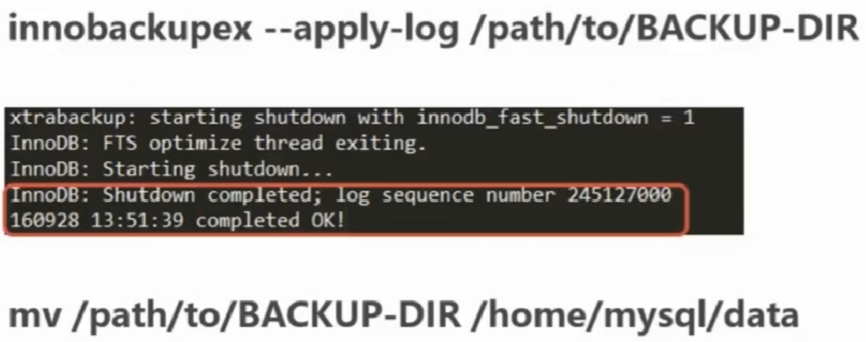

# MYSQL数据库备份
- 对于任何数据库来说，备份都是非常重要的
- 数据库的主从同步并不能取代数据库的备份功能（当出现故障时主从的延时可能会导致数据缺失）

#### 1 逻辑备份和物理备份
- 逻辑备份的结果为sql语句，适合于所有存储引擎，逻辑备份花费的时间较长（mysqldump就属于逻辑备份）
- 物理备份是对数据库目录的拷贝，对于内存表只备份结构（比逻辑备份快，直接拷贝目录就行了）
  -- 离线物理备份，需要关闭数据库业务进行冷备份
  -- 在线物理备份，可以在线进行热备份，不用关闭数据库，可以使用第三方备份工具：`percona`软件的`xtrabackup`工具

#### 2 全量备份和增量备份
- 全量备份就是对整个数据库进行的一个完整备份
- 增量备份是在上次全量或增量备份的基础上，对于更改数据进行的备份
> msyqldump 工具并不支持增量备份
> xtrabackup 提供增量备份功能，对INNODB更加安全和高效
> 通过对mysql的binlog二进制日志来进行增量备份（无论使用什么工具备份，在恢复时需要使用恢复时间点的二进制日志，所以二进制日志的备份都要做）

#### 3 mysqldump 官方工具备份（逻辑备份，在线热备，恢复时需要关闭数据库冷恢复）
+ 第一步： mysqldump 备份和常用参数解析
```sql
mysqldump -h ip -u root -p db_name > mysqldump001.sql
```
- 常用参数：用户参数和用户备份需要的权限


- 常用参数：用户参数和用户备份需要的权限
```
--single-transaction 会在备份开始前，启动一个事物，保证数据库在备份开始时的一致性，此时所有的会dbl被隔绝，只支队INNODB存储引擎有效
-l, --lock-tables 非INNODB引擎是使用，确保数据的一致性，会锁定所有数据表（表混合使用了两个引擎使用这个参数，不确定一致性）
-x, --lock-all-talbe 对数据库中所有实例得的表进行加锁，执行是数据库只读
--master-data=1  值为2，那么CHANGE MASTER TO 语句会被写成一个SQL comment（注释），从而只提供信息; 值为1，那么语句不会被写成注释并且在dump被载入时生效。默认值为1。自动忽略 --lock-talbe 参数
 
-R,--routines 记录存储过程
--triggers 指定备份数据库中所存在的触发器
-E,--events 指定备份数据中的调度事件

--hex-blob 字段类型 date,blog等类型数据存储为16进制格式存储
--tab=path 会在指定路径下为数据库每个表生成两个文件 ，一个文件存储表结构哦，一个存储表数据
-w,--where="条件" 指定条件导出，但是只支持单表导出
```

+ 第二步：  mysqldump 备份实例
- 创建一个备份用户
```sql
create user 'backup'@'localhost' identified by '123456';
grant select,file,reload,lock tables,replication client,show view,event,process on *.* to 'backup'@'localhost';
```
- 单数据库备份

- 单数据库单表备份

- 全量数据库备份

- --where参数的使用

- --tab参数的使用


+ 第三步： 恢复mysqldump备份的数据库文件
- 客户端恢复：`mysql -u -p dbname < /backupdir/backup.sql`
- 进入命令行恢复：`mysql> source /backupdir/backup.sql`
> 单线程恢复，速度和服务器的cpu和IO性能有关
- 使用--tab参数导出的数据库的恢复（因为产生了 表结构和表数据 两个文件，所以要分开导入）
导入数据表结构（选择一个恢复方式）
此处使用：进入命令行恢复：`mysql> source /backupdir/table_user_desc.sql`
加载数据`mysql> load data infile '/backupdir/table_user_data.txt' into table table_user;`


#### 4 Mysqldump工具 + Binlog 工具实现指定时间点的备份恢复
需求： 恢复到误操作的时间
先决条件：
- 具有指点时间点前的一个全备
- 具有自上次全备后到指定时间点的所有二进制文件

恢复步骤：
> 数据库全备文件`/backupdir/allbackup.sql` 
```sql
# 首先恢复一个最近日期的全备文件
mysql -uroot -p db_name < /backupdir/allbackup.sql
```
查看全备份文件的二进制日志的文件编号和master信息，在这个信息之后的数据到误操作之间的数据需要恢复
```bash
more /backupdir/allbackup.sql
```

进入mysql二进制文件的日志目录，查看所有二进制文件`cat /var/log/mysql/`

`mysqlbinlog --base64-output=decode-rows -vv --start-position=84882 --database=mc_orderdb mysql-bin.000011 | grep -B DELETE | more`

通过分析还需要恢复从全备份 84882 到 169348 之间的数据
```bash
# 将全备的日志ID到误操作的日志ID的差异数据导出一个sql文件
mysqlbinlog --start-position=84882 --stop-position=169348 --database=mc_orderdb mysql-bin.000011 > mc_order_diff.sql
# 将sql文件导入到数据库
mysql -uroot - p mc_orderdb < mc_order_diff.sql
```

#### 5 Binlog工具实时二进制日志备份
```sql
# 进入mysql命令行 创建备份二进制文件的账户 userbinlog
> grant replication slave on *.* to 'userbinlog'@'localhost' identified by '123456';

mysqlbinlog --rwa --read-from-remote-server --stop-nerver --host localhost --port 3306 -u userbinlog -p123456 mysql-bin.000011
```

#### 6 xtrabackup 备份工具（物理备份，在线热备，恢复时需要关闭数据库冷恢复）


+ 第一步：安装依赖库
```bash
yum install -y perl-DBD-MySQL.X86 perl-DBl.x86 perl-Time-HiRes.x86_64 perl-IO-Socker-SSL.noarch perl-TermReadKey.x86_64
```
+ 第二步：[xtrabackup下载地址](https://www.percona.com/downloads/XtraBackup/LATEST/) 
```bash
rpm -ivh percona-ctrabackup-24-2.4.4-1.el6.x86_64.rpm
```

+ 第三步：备份数据库
```bash
innobackupex --user=root --password=pwd --parallel=2 /home/db_backup/ --no-timestamp
#参数解析：
--parallel=2 指定备份是使用的线程数，并发备份 
/home/db_backup/ 指定备份到的目录
--no-timestamp 生成时不指定时间戳生成的目录
```
+ 第四步：利用innobackupex 进行全备的恢复

>全备份后的目录: /home/db_backup/2019-04-02_10-30-30 , MYSQL使用中的数据库文件目录位置 : /mysql/data
```
# 导入最新数据到全备目录中
innobackupex --apply-log /home/db_backup/2019-04-02_10-30-30

# mysql实例的停止
/etc/init.c/mysqld stop

# 用备份目录替换数据库目录
mv /mysql/data mv /mysql/data_bak
mv /home/db_backup/2019-04-02_10-30-30 /mysql/data
chown -R mysql:mysql /mysql/data

# mysql实例的启动
/etc/init.c/mysqld start
```
+ 第五步：利用 innobackupex 进行增量备份
```bash
# 全备 备份后的目录为 /home/db_backup/全备目录
innobackupex --defaults-file=/etc/my.cnf --user=root --password=pwd --incremental /home/db_backup/ 

# 第一次增量备份 增量备份目录为 /home/db_backup/增备目录1
innobackupex --defaults-file=/etc/my.cnf --user=root --password=pwd --incremental /home/db_backup/ --incremental-basedir=/home/db_backup/全备目录

# 第二次增量备份 增量备份目录为 /home/db_backup/增备目录2
innobackupex --defaults-file=/etc/my.cnf --user=root --password=pwd --incremental /home/db_backup/ --incremental-basedir=/home/db_backup/增备目录1


# 参数详解：
--incremental-basedir 参数：指定增量备份的基础备份目录
```


+ 第六步：利用 innobackupex 进行全量和增量的数据恢复

```bash
# 步骤1：处理全量备份事务日志 
innobackupex --apply-log --redo-only /home/db_backup/全备目录

# 步骤2：处理第一次增量备份事务并导入到全备目录中
innobackupex --apply-log --redo-only /home/db_backup/全备目录 --incremental-dir /home/db_backup/增备目录1

# 步骤3：处理第二次增量备份事务并导入到全备目录中
innobackupex --apply-log --redo-only /home/db_backup/全备目录 --incremental-dir /home/db_backup/增备目录2

# ........

# 步骤4：停止PXC数据库集群，删除所有节点的现有数据库目录数据（或另存一份）
mv /var/lib/mysql/* /var/lib/mysql_bak

# 步骤5：执行数据恢复（注意：当恢复的数据量特别大时，应该将备份数据在所有节点都执行数据恢复，数据量较小时可以只在主节点恢复然后从节点会自动同步的。）
innobackupex --defaults-file=/etc/my.cnf --copy-back /home/db_backup/全备目录

# 步骤6：恢复mysql数据目录的权限
chown -R mysql:mysql /var/lib/mysql

# 步骤7：启动PXC数据库的主节点，然后依次启动从节点（从节点会自动同步主节点数据）
主节点启动：systemctl start mysql@bootstrap.service
从节点启动：/etc/init.c/mysqld start

# 参数详解
--apply-log 处理备份数据的事务日志
--redo-only 在当前备份跳过未提交事务的回滚，防止后面增量数据有此事务的提交导致增量备份恢复时冲突而无法使用的问题

```
