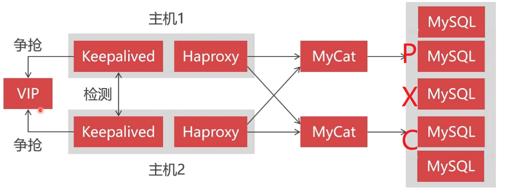

# Docker搭建高可用MyCat+PXC集群
> 注意：为了快速实现方案的部署使用了docker容器技术，这篇教程主要是在单机测试集群方案是否能够运行，实际的线上环境因为要考虑到实体机运行docker时的ip通讯等问题，线上业务部署的时候要考虑通讯等问题。

### 1.部署方案规划
- 5节点的MYSQL自动同步集群（使用percona/percona-xtradb-cluster）
- 2节点MyCat负载服务 提供MYSQL集群的数据库负载均衡（读写分离和数据库分片请查看官方文档[MyCat权威指南](./source/mycat-definitive-guide.pdf)）
+ 2节点Haproxy负载服务 提供MyCat节点的负载均衡
  - Keepalived 工作机制：其中一个抢到，另外一个会检测对方的服务是否正常
  - Haproxy 中部署 Keepalived 是为了让两台服务器争抢一个虚拟IP，这样对外使用虚拟IP提供服务，如果首先抢到虚拟IP的 Keepalived 服务器死机，这个虚拟IP就会被另外一台服务器 Keepalived 抢到继续提供对外服务。

### 2.部署方案实施步骤
[Docker部署PXC高可用集群方案脚本说明](./docker/使用说明.md)
